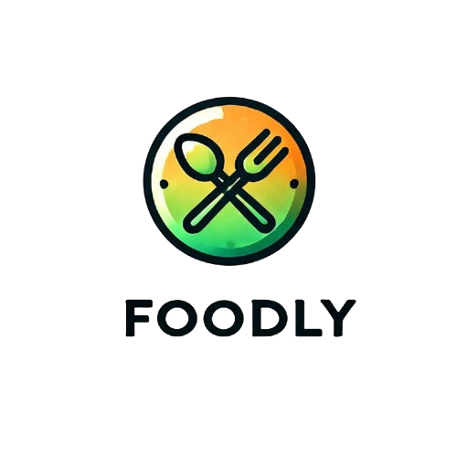

# 🍔 Foodly Eateries - Restaurant Management Dashboard

A modern, full-stack restaurant management application built with React Router, TypeScript, and Tailwind CSS. This application provides restaurant owners with a comprehensive dashboard to manage orders, track performance metrics, and handle customer interactions.



## ✨ Features

### 🏪 Restaurant Management
- **Real-time Order Management** - Track pending, preparing, and completed orders
- **Performance Analytics** - Monitor daily revenue, order counts, and customer satisfaction
- **Customer Insights** - View customer details and order history
- **Status Tracking** - Real-time order status updates with time estimates

### 🔐 Authentication & Security
- **Email/Password Authentication** - Secure login and registration
- **Google OAuth Integration** - Quick social login option
- **Email Verification** - OTP-based email verification system
- **Protected Routes** - Route-level authentication protection
- **Role-based Access** - Eatery-specific user roles

### 💻 Technical Features
- **Server-side Rendering** - Fast page loads with SSR
- **Hot Module Replacement** - Instant development feedback
- **TypeScript Support** - Type-safe development
- **Responsive Design** - Mobile-first responsive UI
- **Modern UI Components** - Built with Radix UI and Tailwind CSS
- **State Management** - Zustand for efficient state handling

## 🛠️ Tech Stack

### Frontend
- **React Router v7** - Full-stack React framework
- **TypeScript** - Type-safe JavaScript
- **Tailwind CSS** - Utility-first CSS framework
- **Radix UI** - Accessible component primitives
- **Lucide React** - Beautiful icon library
- **Zustand** - Lightweight state management

### Backend Integration
- **Axios** - HTTP client for API calls
- **REST API** - Backend communication
- **JWT Authentication** - Secure token-based auth

### Development Tools
- **Vite** - Fast build tool and dev server
- **ESLint & Prettier** - Code formatting and linting
- **Docker** - Containerization support

## 🚀 Getting Started

### Prerequisites
- Node.js (v20 or higher)
- npm or yarn
- Backend API server running on `http://localhost:3001`

### Installation

1. Clone the repository:
```bash
git clone <repository-url>
cd foodly/eateries
```

2. Install dependencies:
```bash
npm install
```

3. Start the development server:
```bash
npm run dev
```

4. Open your browser and navigate to `http://localhost:5173`

### Environment Configuration

Ensure your backend API is running on `http://localhost:3001` or update the `BACKEND_URL` in `app/lib/constants.ts`.

## 📱 Application Structure

```
├── app/
│   ├── components/ui/        # Reusable UI components
│   ├── lib/                  # Utilities and constants
│   ├── routes/              # Application routes
│   │   ├── auth/            # Authentication pages
│   │   ├── home.tsx         # Main dashboard
│   │   └── about.tsx        # About page
│   ├── store/               # State management
│   │   └── auth-store/      # Authentication store
│   ├── axios/               # API configuration
│   └── welcome/             # Welcome assets
├── public/                  # Static assets
├── Dockerfile              # Container configuration
└── package.json            # Dependencies and scripts
```

## 🔧 Available Scripts

```bash
# Development
npm run dev          # Start development server

# Building
npm run build        # Create production build
npm run start        # Start production server

# Type checking
npm run typecheck    # Run TypeScript type checking
```

## 🐳 Docker Deployment

### Build and Run with Docker

```bash
# Build the Docker image
docker build -t foodly-eateries .

# Run the container
docker run -p 3000:3000 foodly-eateries
```

### Deployment Platforms

This application can be deployed to:
- **AWS ECS** - Container orchestration
- **Google Cloud Run** - Serverless containers
- **Azure Container Apps** - Managed container platform
- **Digital Ocean App Platform** - Simple app deployment
- **Fly.io** - Global app deployment
- **Railway** - Developer-first deployment

## 📊 Key Features Breakdown

### Dashboard Analytics
- Daily order count and revenue tracking
- Average order value calculations
- Customer satisfaction metrics
- Real-time performance indicators

### Order Management
- Order status tracking (Pending → Preparing → Ready)
- Customer information display
- Pickup time management
- Order completion workflow

### User Experience
- Clean, intuitive interface
- Responsive design for all devices
- Fast loading with optimized assets
- Accessible UI components

## 🔐 Authentication Flow

1. **Registration** - Users create accounts with email verification
2. **Email Verification** - OTP-based verification system
3. **Login** - Email/password or Google OAuth
4. **Session Management** - Secure token-based sessions
5. **Protected Access** - Route-level authentication checks

## 🤝 Contributing

1. Fork the repository
2. Create a feature branch (`git checkout -b feature/amazing-feature`)
3. Commit your changes (`git commit -m 'Add some amazing feature'`)
4. Push to the branch (`git push origin feature/amazing-feature`)
5. Open a Pull Request

## 📝 License

This project is licensed under the MIT License - see the LICENSE file for details.

## 🙏 Acknowledgments

- Built with [React Router](https://reactrouter.com/)
- UI components from [Radix UI](https://www.radix-ui.com/)
- Styled with [Tailwind CSS](https://tailwindcss.com/)
- Icons from [Lucide React](https://lucide.dev/)

---

**Built with ❤️ for restaurant owners who want to streamline their operations and delight their customers.**
